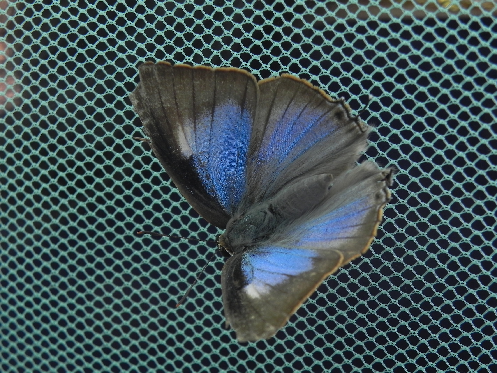
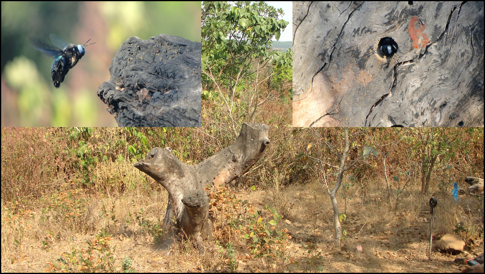

## Saryan Vigyan Foundation (2023 onwards)

* **Safeguarding Himalayan plant diversity in changing climates**

  We presented our work so far with Saryan Vatika at the [8th Global Botanic Gardens Congress](https://web.archive.org/web/20250711091320/https://www.8gbgc.sbg.org.sg/).
  Please find additional information in [Guardians of the green: Safeguarding Himalayan plant diversity in changing climates at a high-altitude botanical garden](https://web.archive.org/web/20240925120613/https://www.8gbgc.sbg.org.sg/Storage/PDFs/AbstractPDF/ABS-00262.pdf)

* **The Green Hour** community outreach

  Our *Green Hour* work covered in the [local newspaper *Divya Himachal*](https://www.saryanfoundation.org/post/the-green-hour-inspiring-young-minds-in-kinnaur)

* **Adapting agriculture in the face of climate change**

  I wrote about the challenges agricultural communities face and potential solutions
  in the [first edition of the Kacha magazine by Zed tells](https://www.zedtells.com/copy-of-kacha).

Why I founded Saryan Vigyan Foundation and how we approach fundamental
research were recorded in this [short documentary](https://www.youtube.com/watch?v=6j9WyAMmsX8)
as part of the [HimKatha India initiative](https://www.himkatha.org/) by [Nature Conservation Foundation India](https://www.ncf-india.org/).
You could also watch to [this video](https://youtu.be/VhM9VyQu9tg?si=PBwtC2alig5I65GZ)
where I was interviewed about my journey.

::: {.column-margin}

:::

::: {.column-margin}

:::

## Graduate studies (2015-2021)

* **Low-cost FloPump for regulated air sampling of volatile organic compounds**

  We built a low-cost, battery-operated, portable pump, “FloPump,” which allows
  regulated air sampling for the study of volatile organic compounds (VOCs).
  VOCs are routinely investigated in applications such as atmospheric chemistry,
  agriculture, and fragrance biology. Our work was published in [Applications in Plant Sciences](https://bsapubs.onlinelibrary.wiley.com/doi/10.1002/aps3.11343).

  I also spoke about the FloPump and Open Biology at [IndiaFOSS 2023](https://www.youtube.com/watch?v=PegX9n9gvto).

::: {.column-margin}

:::

* **Discoveries and rediscoveries: Stoneflowers in northeast India**

  I collected specimens during my graduate research in the North-East India that
  led to the discovery of a new *Didymocarpus* species. The discovery was reported in [Mongabay India](https://india.mongabay.com/2020/07/discoveries-and-rediscoveries-stoneflowers-in-northeast-india/).
  Our work was published in [RHEEDEA](https://journals.rheedea.in/journal/rhiaG1dH).

*  **Species complex delimitations in the genus *Hedychium*: A machine learning approach for cluster discovery**

   We applied spectral clustering algorithm for the unsupervised discovery of species
   boundaries followed by the analysis of the cluster-defining characters. Our work
   was published in [Applications in Plant Sciences](https://bsapubs.onlinelibrary.wiley.com/doi/10.1002/aps3.11377).
   We also presented this work at the [Botany 2020 conference](http://2020.botanyconference.org/engine/search/index.php?func=detail&aid=715).

* **Diversity of the genus Hedychium J. Koenig (Zingiberaceae) in the Northeast of India-II: Manipur and Nagaland.**

  Our study of the diversity of Genus *Hedychium* in the Northeast India (Manipur and Nagaland)
  was published in [Heliconia Society International](https://www.heliconia.org/back-issues?lightbox=dataItem-kjrwalrt)

## Undergraduate studies (2009-2014)

* **Pre-dispersal seed predation of Catunaregam spinosa**: August 2014-May 2015

  With [Dr. Hema Somanathan, IISER Trivandrum](http://www.iisertvm.ac.in/faculties/hsomanathan) and [Dr. Deepak Barua, IISER Pune](http://www.iiserpune.ac.in/~dbarua/),
  I monitored the phenology and fruit infestation in Catunaregam spinosa . I also
  studied the pre-dispersal seed predator Deudorix perse to understand it's behaviour.
  The work was carried out at the [Bhimashankar Wildlife Sanctuary](https://en.wikipedia.org/wiki/Bhimashankar_Wildlife_Sanctuary), Maharashtra, India.
  A detailed report that discusses the work can be found here.

::: {.column-margin}

:::

* **Temporal flight patters in diurnal & nocturnal Indian carpenter bees**: August 2013-May 2014

  I observed three sympatric carpenter bee species in their natural nesting habitat
  to study their temporal flight patterns, the niche overlap and abiotic factors
  affecting onset & offset of flight activity as a part of my Masters thesis under
  the supervision of Dr. Hema Somanathan. Part of my thesis is published in the
  [Journal of Comparative Physiology A](https://link.springer.com/article/10.1007/s00359-019-01323-7).

::: {.column-margin}

:::

* **Chemical synthesis & biological studies of beta-D-galactopyranosyl triazoles**: August 2011-May 2012

  I synthesized Galactose based triazoles using click chemistry and assessed purity
  and structure of the compounds through NMR. These compounds were further studied
  for their medicinal properties by subjecting to HeLa cells. This project was part
  of my Minor project with Dr. K.M. Sureshan (School of Chemistry, IISER-TVM) as a part of Dual-BS-MS degree.

* **Vegetation & structural composition of Myristica swamp species**: August 2011-May 2012

  As part of a larger ongoing project on Myristica swamps, I was involved in
  characterizing the vegetation composition and structural features of Myristica
  swamps. I was part of developing the baseline information on the influence of
  habitat fragmentation on adult species richness and abundance in these swamp
  forests. I did this work in Dr. Hema Somanathan's lab as an intern.

* **Influence of spatial structure on reproductive success of B. Courtallensis**: August 2011-May 2012

  As an intern in the lab of Dr. Hema Somanathan, I looked at the multiple
  aspects of the reproductive ecology of Baccaurea courtallensis, this included
  determination of sex ratio, spatial dynamics using point pattern analysis and
  the effect of neighbouring trees on the fruit-set of females.

* **Dietary assessment of two stream dwelling anurans**: May 2011-July 2011, Dec 2011

  Along with [Dr. Seshadri KS](http://www.atree.org/) and [Dr. T. Ganesh](http://www.atree.org/),
  I studied dietary composition, tropic niche width & overlap on the diets of arthropodivorous anurans,
  Micrixalus fuscus & Nyctibatrachus cf. vasanthi. Study involved bolus collection from live frogs in
  Kalakad Mundanthurai Tiger Reserve, Tamil Nadu and identification of insects in bolus.

  Our work was published in the [Journal of Natural History](https://www.tandfonline.com/doi/abs/10.1080/00222933.2025.2476122)
